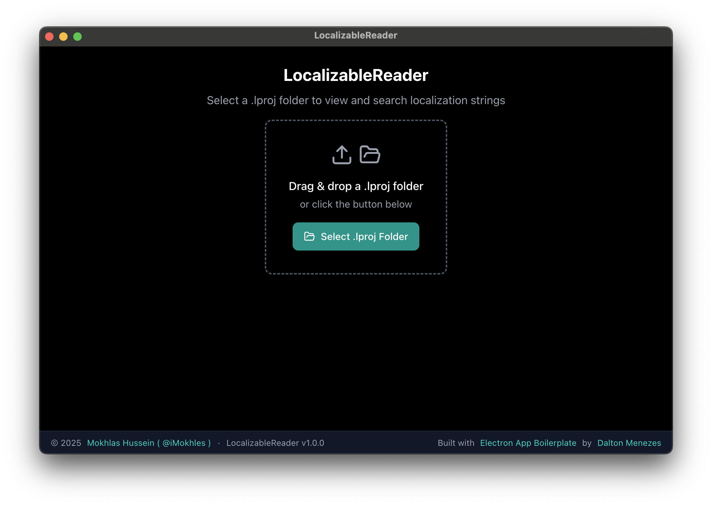

# LocalizableReader

<div align="right">
  <a href="README.md">🇺🇸 English</a> | <a href="README.ar.md">🇸🇦 العربية</a>
</div>

<div align="center">
  
  
  <h3>تطبيق سطح مكتب قوي لقراءة والبحث وإدارة سلاسل الترجمة الخاصة بـ iOS/macOS من مجلدات `.lproj`</h3>
  
  <p>مبني باستخدام Electron و React، يوفر LocalizableReader واجهة بديهية للمطورين الذين يعملون مع ترجمات متعددة اللغات.</p>
  
  <div style="background-color: #f8f9fa; padding: 20px; border-radius: 8px; margin: 20px 0; border-left: 4px solid #007acc;">
    <h4>🎯 لماذا هذا المشروع مهم</h4>
    <p><strong>مثالي لهندسة عكسية تطبيقات iOS/macOS:</strong> عند استخراج مجلدات `.lproj` من ملفات IPA، تكون سلاسل الترجمة في تنسيق ثنائي وتحتاج إلى تحويل إلى JSON لتكون قابلة للقراءة. يجعل LocalizableReader هذه العملية سلسة، مما يساعدك على العثور بسهولة على سلاسل الترجمة وتحليلها عند هندسة عكسية ملفات تطبيقات iOS/macOS.</p>
  </div>
  
  
  
  <br><br>
  
  
  
  
</div>

## ✨ المميزات

### 🔍 **تحليل الملفات الذكي**
- **الكشف التلقائي**: يجد ويحلل ملفات `.strings` في مجلدات `.lproj` تلقائياً
- **تكامل plutil**: يستخدم أمر `plutil` الأصلي لـ macOS لتحويل JSON موثوق
- **دعم ملفات متعددة**: يتعامل مع مشاريع تحتوي على مئات ملفات الترجمة

### 🎯 **بحث وتصفية قوي**
- **بحث فوري**: البحث في قيم الترجمة مع إدخال متأخر
- **تصفية الملفات**: تصفية الإدخالات حسب ملفات `.strings` محددة
- **ترقيم ذكي**: التعامل بكفاءة مع مجموعات البيانات الكبيرة مع 10 إدخالات لكل صفحة

### 🖱️ **واجهة بديهية**
- **السحب والإفلات**: ببساطة اسحب مجلد `.lproj` للبدء
- **واجهة حديثة**: واجهة نظيفة ومظلمة مبنية بـ Tailwind CSS
- **تصميم متجاوب**: محسن لأحجام الشاشات المختلفة

### 📋 **نسخ وتصدير**
- **نسخ بنقرة واحدة**: نسخ المفاتيح أو القيم الفردية إلى الحافظة
- **إرشادات التلميحات**: مؤشرات بصرية واضحة لكل إجراء

### 🚀 **الأداء**
- **تحميل سريع**: محسن لمشاريع الترجمة الكبيرة
- **كفاءة في الذاكرة**: الترقيم يمنع مشاكل الذاكرة مع مجموعات البيانات الضخمة
- **تمرير سلس**: عناوين ثابتة وتنقل سلس في الجدول

## 📋 خارطة الطريق

### 🚧 **قيد التطوير**
- **🪟 دعم Windows**: اختبار وتحسين التوافق الكامل مع Windows
- **🐧 دعم Linux**: دعم واختبار كامل لتوزيعات Linux

### 🔮 **مميزات مستقبلية**
- **🌍 إدارة متعددة اللغات**: إدارة ودعم عدة لغات في نفس الوقت مع مقارنة جنباً إلى جنب
- **📊 خيارات التصدير**: تصدير إلى CSV، JSON، أو تنسيقات Excel
- **🔍 بحث متقدم**: بحث regex وخيارات تصفية متقدمة
- **📱 دعم الهاتف المحمول**: تطبيقات مرافقة لـ iOS و Android
- **☁️ مزامنة السحابة**: مزامنة المشاريع عبر الأجهزة
- **🎨 تخصيص المظهر**: خيارات مظهر فاتح/مظلم
- **🔄 سير عمل الترجمة**: إدارة الترجمة المدمجة وتتبع التقدم

## 🛠️ التقنيات

- **🔋 Electron** - إطار عمل سطح المكتب متعدد المنصات
- **⚛️ React 19** - مكتبة واجهة مستخدم حديثة مع hooks
- **💙 TypeScript 5** - تطوير آمن للنوع
- **🎨 Tailwind CSS 4** - تنسيق أولي للأدوات
- **🎯 shadcn/ui** - مكونات جميلة ويمكن الوصول إليها
- **🍦 Lucide Icons** - أيقونات متسقة
- **📦 Zustand** - إدارة حالة خفيفة الوزن
- **🔄 React Dropzone** - وظائف السحب والإفلات

## 📦 التثبيت

### المتطلبات الأساسية
- Node.js 20 أو أعلى
- pnpm 10 أو أعلى

### إعداد التطوير
```bash
# استنساخ المستودع
git clone https://github.com/imokhles/localizable-reader.git
cd localizable-reader

# تثبيت التبعيات
pnpm install

# بدء خادم التطوير
pnpm dev
```

### البناء للإنتاج
```bash
# بناء لجميع المنصات
pnpm build

# بناء لمنصة محددة
pnpm build --mac
pnpm build --win
pnpm build --linux
```

## 🚀 الاستخدام

### البدء
1. **تشغيل LocalizableReader**
2. **اختيار مجلد .lproj** من خلال:
   - سحب وإفلات المجلد على التطبيق
   - النقر على "اختيار مجلد .lproj" والتنقل إلى مجلدك
3. **تصفح الترجمات** في عرض الجدول
4. **البحث والتصفية** باستخدام شريط البحث وقائمة الملفات
5. **نسخ المفاتيح أو القيم** باستخدام أزرار النسخ

### أنواع الملفات المدعومة
- ملفات `.strings` (تنسيق ترجمة iOS/macOS)
- مجلدات `.lproj` تحتوي على ملفات `.strings` متعددة

### اختصارات لوحة المفاتيح
- **Cmd/Ctrl + F**: التركيز على شريط البحث
- **Escape**: مسح البحث
- **مفاتيح الأسهم**: التنقل في صفوف الجدول
- **Enter**: نسخ العنصر المحدد

## 📁 هيكل المشروع

```
localizable-reader/
├── src/
│   ├── main/                 # عملية Electron الرئيسية
│   │   ├── services/        # خدمة تحليل الترجمة
│   │   └── ipc/            # التواصل بين العمليات
│   ├── renderer/            # عملية عرض React
│   │   ├── components/      # مكونات واجهة المستخدم
│   │   ├── lib/            # الأدوات والمتاجر
│   │   └── screens/        # شاشات التطبيق الرئيسية
│   ├── shared/             # الأنواع والثوابت المشتركة
│   └── resources/          # الأيقونات والأصول
├── dist/                   # التطبيقات المبنية
└── docs/                   # الوثائق
```

## 🔧 التطوير

### النصوص المتاحة
```bash
pnpm dev          # بدء خادم التطوير
pnpm build        # بناء للإنتاج
pnpm start        # معاينة التطبيق المبنى
pnpm lint         # تشغيل أداة التحليل
pnpm lint:fix     # إصلاح مشاكل التحليل
```

### الهندسة المعمارية
- **نمط MVVM**: فصل واضح للاهتمامات
- **متجر Zustand**: إدارة حالة مركزية
- **تواصل IPC**: تواصل آمن بين الرئيس والعرض
- **TypeScript**: أمان نوع كامل في جميع أنحاء

## 🤝 المساهمة

المساهمات مرحب بها! يرجى عدم التردد في تقديم طلب سحب. للتغييرات الكبيرة، يرجى فتح مشكلة أولاً لمناقشة ما تريد تغييره.

### إرشادات التطوير
1. اتبع نمط الكود الموجود
2. أضف اختبارات للمميزات الجديدة
3. حدث الوثائق حسب الحاجة
4. تأكد من نجاح جميع الفحوصات

## 📄 الترخيص

هذا المشروع مرخص تحت رخصة MIT - راجع ملف [LICENSE](LICENSE) للتفاصيل.

## 🙏 شكر وتقدير

هذا المشروع مبني باستخدام [Electron App Boilerplate](https://github.com/daltonmenezes/electron-app) الممتاز بواسطة [Dalton Menezes](https://github.com/daltonmenezes).

يوفر النموذج:
- 🔥 هيكل سريع وجاهز للاستخدام مع React 19، TypeScript 5، و Tailwind CSS 4
- 🚀 إعادة تحميل تلقائي للعملية الرئيسية و Fast Refresh للعرض
- 🎉 توجيه النوافذ/الشاشات مع Electron Router DOM
- 🔮 إصدارات GitHub Action لـ Windows، Mac، و Linux
- 🔒 دعم حماية الكود المصدري
- 🍪 دعم المسارات المطلقة

شكر خاص لـ Dalton لإنشاء نموذج شامل ومحافظ عليه جيداً يجعل تطوير Electron سهلاً! 🌟

---

**صُنع بـ ❤️ لمجتمع تطوير iOS/macOS**
